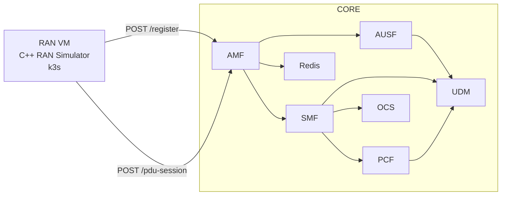
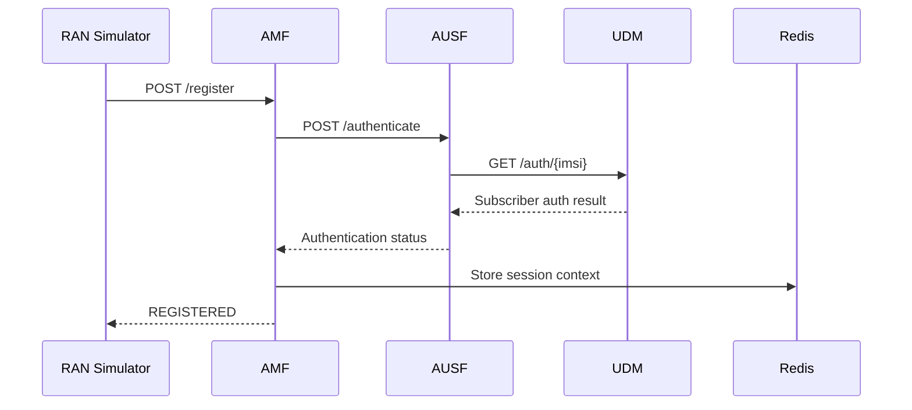
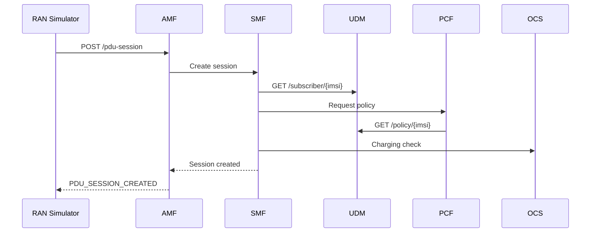

# telecom-lab-RAN

Cloud-native RAN simulator designed to interact with a distributed 5G Core environment running on Kubernetes.

This project simulates simplified 5G RAN behavior and communicates with a remote Core Network running in another VM.  
The goal is to demonstrate distributed telecom architecture, service decomposition, Kubernetes networking, and 5G control-plane flows.

---

# Features

- C++ RAN simulator
- Distributed RAN → Core communication
- 5G Registration flow
- PDU Session establishment
- Multi-VM telecom lab
- Kubernetes deployment
- Prometheus metrics
- Cloud-native telecom architecture

---

# Environment

## RAN VM

- Ubuntu 24.04
- k3s
- C++ RAN simulator
- VS Code + CMake

## CORE VM

Core components run in a separate VM using Minikube:

- AMF
- AUSF
- UDM
- SMF
- PCF
- OCS
- Redis
- HAProxy

Core repository:

- https://github.com/marijan-madunic/telecom-lab

---

# Architecture



---

## Registration Flow



## PDU Session Flow



---

# Distributed Setup

The RAN simulator runs in a separate VM and communicates with the Core VM over the network.

Example:
```bash
curl http://192.168.208.129:30086/health
```

This confirms:
RAN VM → CORE VM → Kubernetes → AMF

## Example Registration

```bash
curl -X POST http://192.168.208.129:30086/register \
  -H "Content-Type: application/json" \
  -d '{"imsi":"001010000000002"}'
```
Response:
```json
{
  "imsi": "001010000000002",
  "session_id": "sess-1a76c10879",
  "status": "REGISTERED"
}
```
## Example PDU Session

```bash
curl -X POST http://192.168.208.129:30086/pdu-session \
  -H "Content-Type: application/json" \
  -d '{"imsi":"001010000000002","dnn":"internet"}'
```
Response:
```json
{
  "status": "PDU_SESSION_CREATED",
  "imsi": "001010000000002"
}
```
---

# RAN Metrics

Example metrics:
```text
ran_events_total
ran_measurement_reports_total
ran_handover_candidates_total
ran_rsrp_dbm
ran_rsrq_db
ran_sinr_db
```
Metrics endpoint:
```bash
curl http://localhost:8000/metrics
```

---

# Kubernetes Deployment

Deploy RAN simulator:
```bash
kubectl apply -f kubernetes/ran-simulator-deployment.yaml
```

Check pods:
```bash
kubectl get pods -o wide
```

## Build
Install dependencies
```bash
sudo apt update
sudo apt install -y build-essential cmake
```

Build
```bash
cd ran-simulator-cpp

mkdir -p build
cd build

cmake ..
make
```

Run:
```bash
./ran-simulator
```

---

# Documentation
- [Distributed RAN → 5G Core Flow](docs/distributed-ran-core-flow.md)

---

# Goals

This project focuses on:

- cloud-native telecom architecture
- distributed systems
- Kubernetes networking
- telecom control-plane orchestration
- microservice communication
- observability and metrics
- simplified 5G flows

## Future Improvements
- gNodeB simulation improvements
- multi-cell support
- mobility/handover logic
- NRF integration
- HTTP/2 and SBI improvements
- Prometheus + Grafana dashboards
- multi-node Kubernetes cluster
- RAN load simulation

# Author

Marijan Madunic


