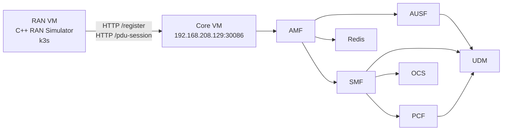
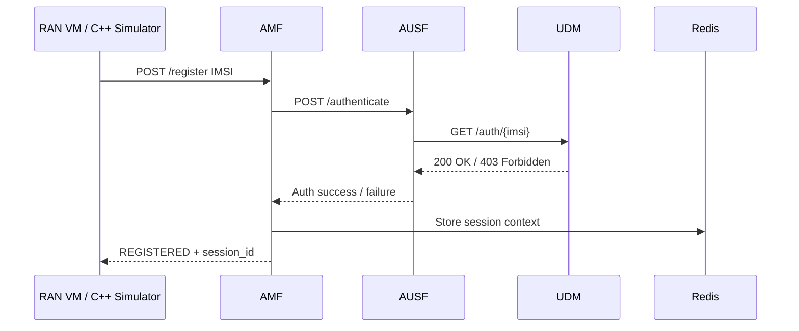
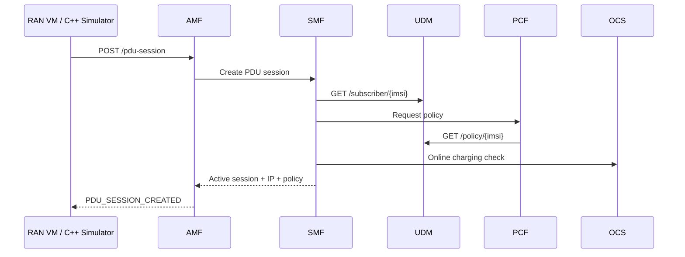

# Distributed RAN → 5G Core Flow

This document shows a distributed lab setup where the RAN simulator runs on a separate VM and communicates with a 5G Core running in another Kubernetes environment.

## Architecture




## Environment

```text
RAN VM:
- Project: telecom-lab-RAN
- Runtime: k3s
- Component: C++ RAN simulator

CORE VM:
- Project: telecom-lab
- Runtime: Minikube
- Components: AMF, AUSF, UDM, SMF, PCF, OCS, Redis
```

## Connectivity

The AMF service is exposed from the Core VM using port-forwarding:
```bash
kubectl port-forward --address 0.0.0.0 svc/amf-service 30086:8086
```

The RAN VM reaches AMF through the Core VM IP:
```bash
curl http://192.168.208.129:30086/health
```

Expected response:
```json
{"redis":"ok","service":"amf","status":"ok"}
```

This confirms:
```text
RAN VM → CORE VM → Minikube → AMF service
```
## Pod Mapping

Output from kubectl get pods -o wide:

10.244.0.31 = AMF
10.244.0.22 = AMF replica
10.244.0.26 = AUSF
10.244.0.29 = UDM
10.244.0.28 = SMF
10.244.0.27 = PCF
10.244.0.30 = Redis
10.244.0.25 = OCS
10.244.0.23 = PCRF
10.244.0.20 = AAA
10.244.0.19 = HAProxy
10.244.0.24 = SMSC

## Registration Flow


### Successful registration test
```bash
curl -X POST http://192.168.208.129:30086/register \
  -H "Content-Type: application/json" \
  -d '{"imsi":"001010000000002"}'
```

Response:
```json
{"imsi":"001010000000002","session_id":"sess-1a76c10879","status":"REGISTERED"}
```

### AMF log
```text
Register request received for IMSI=001010000000002
Session created for IMSI=001010000000002 session_id=sess-1a76c10879
POST /register HTTP/1.1" 200
```

### AUSF log
```text
10.244.0.31 - "POST /authenticate HTTP/1.1" 200
```

10.244.0.31 is the AMF pod. This confirms that AMF calls AUSF over the internal Kubernetes network.

### UDM log
```text
10.244.0.26 - "GET /auth/001010000000002 HTTP/1.1" 200
```

10.244.0.26 is the AUSF pod. This confirms that AUSF queries UDM for subscriber authentication data.

Failed Authentication Example
```bash
curl -X POST http://192.168.208.129:30086/register \
  -H "Content-Type: application/json" \
  -d '{"imsi":"001010000000001"}'
```

Response:
```json
{"imsi":"001010000000001","status":"AUTH_FAILED"}
```

AMF log:
```text
Register request received for IMSI=001010000000001
Authentication failed for IMSI=001010000000001
POST /register HTTP/1.1" 401
```

AUSF / UDM logs:
```text
AUSF: POST /authenticate HTTP/1.1" 403
UDM:  GET /auth/001010000000001 HTTP/1.1" 403
```

This shows that the Core does not return hardcoded success. Authentication depends on subscriber data.

## PDU Session Flow


## PDU session test
```bash
curl -X POST http://192.168.208.129:30086/pdu-session \
  -H "Content-Type: application/json" \
  -d '{"imsi":"001010000000002","dnn":"internet"}'
```
Response:
```json
{
  "amf_session_id": "sess-fb8d7bb0a6",
  "imsi": "001010000000002",
  "status": "PDU_SESSION_CREATED",
  "smf_response": {
    "status": "active",
    "ip_address": "10.20.0.1",
    "dnn": "internet",
    "policy": {
      "allowed": true,
      "charging": "online",
      "plan": "premium",
      "qos_profile": "gold",
      "source": "UDM"
    }
  }
}
```

### AMF log
```text
PDU session request received for IMSI=001010000000002 DNN=internet
PDU session created via SMF for IMSI=001010000000002
POST /pdu-session HTTP/1.1" 201
```
### UDM log
```text
10.244.0.28 - "GET /subscriber/001010000000002 HTTP/1.1" 200
10.244.0.27 - "GET /policy/001010000000002 HTTP/1.1" 200
```
Mapping:
```text
10.244.0.28 = SMF
10.244.0.27 = PCF
10.244.0.29 = UDM
```
This confirms that SMF and PCF retrieve subscriber and policy data from UDM. 


## Explanation

The setup simulates a distributed 5G architecture where the RAN simulator runs on a separate VM and communicates with a remote Core environment hosted on Kubernetes.

The AMF receives UE registration requests, performs subscriber authentication through AUSF, stores session context in Redis, and orchestrates PDU session creation through SMF.

UDM acts as the subscriber data source. During registration, AUSF queries UDM for authentication data. During PDU session creation, SMF and PCF query UDM for subscriber profile and policy information.

The logs show different Kubernetes pod IPs calling UDM, which proves that multiple network functions communicate over the internal cluster network instead of using local hardcoded calls.

This demonstrates:

- distributed RAN-to-Core communication
- service decomposition
- Kubernetes service networking
- subscriber authentication
- session context handling
- policy and charging integration
- simplified 5G registration and PDU session flows

## Author

Marijan Madunić
